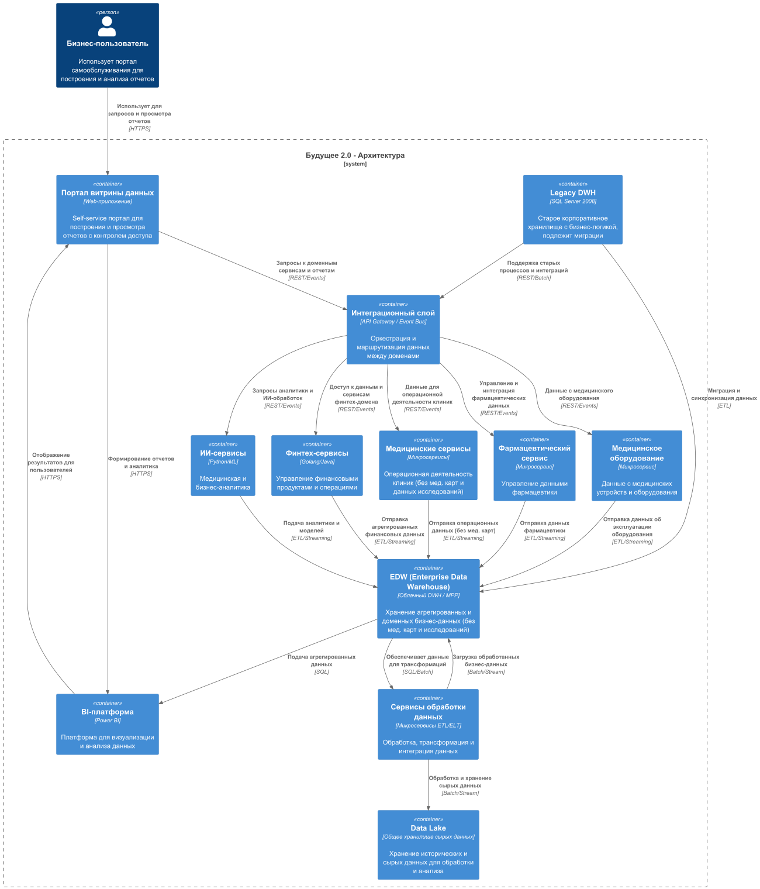

### Диаграмма контейнеров в модели C4 через год

### Проблемные места
|Проблема|Описание|Влияние| Приоритет MoSCoW |
|-|-|-|------------------|
|Сложности миграции с legacy DWH|Миграция данных, синхронизация и обеспечение непрерывности работы с существующей системой|Риски прерывания бизнес-процессов| Must             |
|Управление целостностью данных в микросервисах|Необходимость сохранения согласованности данных при распределенном хранении и обработке|Потенциальные ошибки в отчетах| Must             |
|Координация и оркестрация потоков данных|Обеспечение правильной маршрутизации и интеграции данных через API Gateway и Event Bus|Задержки и сбои в интеграции| Must             |
|Безопасность и контроль доступа|Разделение данных и прав доступа по доменам, обеспечивая конфиденциальность медицинских и финансовых данных|Нарушение законодательных требований| Must             |
|Операционная сложность микросервисов|Управление множеством сервисов, их обновления, мониторинг и отладка|Рост издержек на поддержку| Should           |
|Разделение данных и ответственности|Ясное разделение между доменами (медицина, финансы, фармацевтика) для облегчения развития|Перекрывающиеся обязанности| Should           |
|Оптимизация производительности запросов|Быстрая агрегация данных в витрине с минимальной задержкой|Замедление бизнес-аналитики| Could            |

### Приоритизация проблем (MoSCoW)
- **Must**: Миграция и синхронизация legacy DWH, обеспечение согласованности данных, надежная интеграция через API Gateway, безопасность и контроль доступа
- **Should**: Управление сложностью микросервисов, четкое разделение ответственности между доменами
- **Could**: Оптимизация производительности аналитики и отчетности
