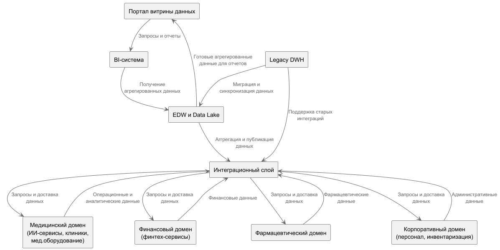

### Разделение системы на домены
| Домен                                | Сервисы                                                                                  | Ответственность                                                                                                                       |
|--------------------------------------|------------------------------------------------------------------------------------------|---------------------------------------------------------------------------------------------------------------------------------------|
| Медицинский домен                    | Операционные сервисы клиник, ИИ-сервисы для медданных, сервисы медицинского оборудования | Управляет всей операционной медицинской информацией, кроме медицинских карт и историй болезни (которые не используются для аналитики) |
| Финансовый домен                     | Финтех-сервисы, банковские продукты, финансовая отчетность                               | Обрабатывает финансовые транзакции, кредиты, счета и финансовый контроль                                                              |
| Фармацевтический домен               | Сервисы интеграции с фармпроизводителями и управление лекарствами                        | Отвечает за данные и процессы, связанные с лекарствами и снабжением                                                                   |
| Корпоративный/административный домен | Управление персоналом, инвентаризация, управление клиниками                              | Включает внутренние сервисы и бизнес-процессы компании                                                                                |
| Витрина данных и аналитика           |                                                                                          | Портал self-service аналитики, BI-система, EDW и Data Lake для агрегации и аналитической подготовки данных                            |
|Legacy-домен|Старый DWH и PowerBuilder)|Поддержка и постепенная миграция на новое решение|

### Data Flow Diagram

### Аргументация
- **Обособленность бизнес-логики**: Каждый домен отвечает за конкретный бизнес-процесс и содержит свою модель данных, что снижает взаимозависимости и уменьшает сложность изменений
- **Автономное развитие**: Домены можно развивать, тестировать и деплоить независимо, что увеличивает скорость поставки новых функций
- **Управление доступом и безопасностью**: проще разграничить права доступа и защитить данные в каждом домене по требованиям законодательства
- **Легче масштабировать**: ресурсы можно выделять по потребностям каждого домена, повышая эффективность
- **Плавная миграция legacy-системы**: отделение legacy-домена позволяет безболезненно перейти на новые технологии, не нарушая работу бизнеса
- **Четкие каналы обмена данными**: интеграционный слой решает проблему сложных связей между системами, упрощая поддержку и изменение архитектуры
- **Self-service аналитика**: витрина данных и BI-портал позволяют бизнесу получать аналитические данные без вмешательства ИТ, снижая нагрузку на операционные системы
