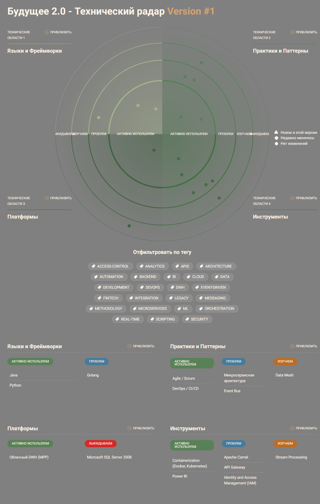
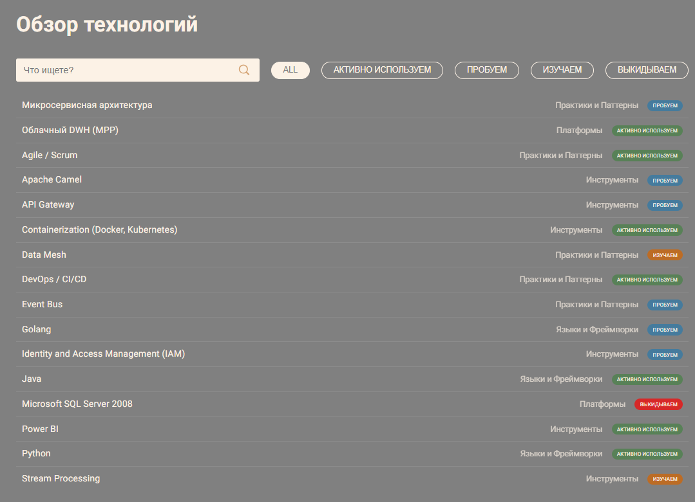
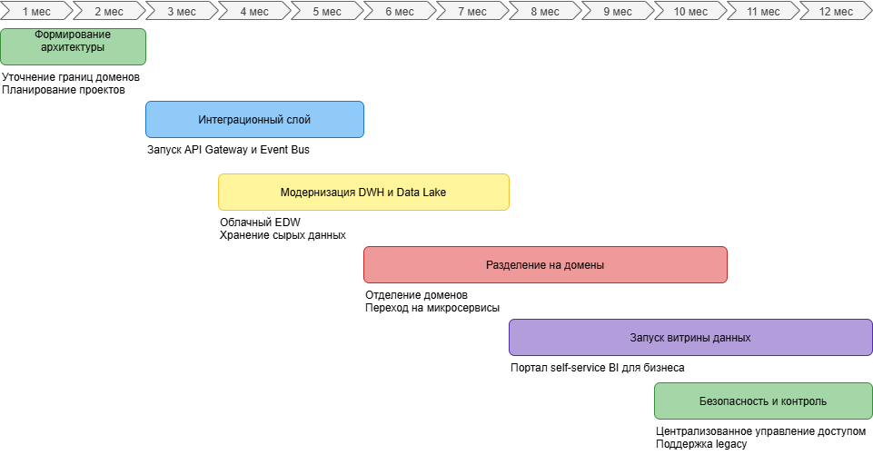

### Технический радар
|Категория|Текущие технологии/методологии|Предлагаемые изменения| Сопутствующие технологии и методологии      |
|-|-|-|---------------------------------------------|
|Хранилище данных|Microsoft SQL Server 2008 (Legacy DWH)|Облачный DWH (MPP), Data Lake| ETL/ELT, Stream Processing, Data Mesh       |
|Аналитика|Power BI с множеством кастомизаций|Self-service BI портал, BI платформа|ML аналитика, визуализация, интерактивные дашборды
|Интеграция данных|Apache Camel, старый интеграционный слой|API Gateway / Event Bus, ESB| Event-driven архитектура, REST/Streaming    |
|Программные сервисы|Монолитный DWH, Power Builder клиенты|Микросервисная архитектура доменов| Контейнеризация (Docker, Kubernetes), CI/CD |
|Языки программирования|Python (ИИ), Golang/Java (финтех)|Открытый к новым технологиям| DevOps, автоматизация, мониторинг           |
|Безопасность и доступ|Локальные решения|Централизованное управление доступом| IAM, RBAC, шифрование данных                |
|Методологии разработки|Классические Waterfall, частично Agile|Agile, Scrum, DevOps| CI/CD, автоматическое тестирование          |

> К сожалению верстка AOE Technology Radar не позволяет отобразить тултипы ко всем технологиям сразу. Но их перечень есть в легенде под диаграмой, а так же во втором скрин-шоте "Обзор технологий". Так же исходник приложения есть в папке с заданием. Запуск `npm i`, потом `npm run serve`

### Структура роадмапа с обоснованиями
| Период        |Этап|Основные результаты|Команды/Роли| Обоснование                                                                                                                                                                                                                              |
|---------------|-|-|-|------------------------------------------------------------------------------------------------------------------------------------------------------------------------------------------------------------------------------------------|
| 1-2 месяца    |Формирование архитектуры|Определение доменов, уточнение связей, планы проектов|Архитекторы, аналитики| Этот этап необходим для уточнения границ доменов и формирования общего архитектурного решения. Планируются ключевые проекты по развитию витрины данных, что уменьшает риски дальнейших противоречий и обеспечивает общее понимание целей |
| 3-5 месяцев   |Запуск интеграционного слоя|API Gateway/Event Bus готов, интеграции доменов|DevOps, интеграторы| Внедрение API Gateway и Event Bus создает гибкую и масштабируемую инфраструктуру маршрутизации данных между доменами. Это фундамент для отказа от монолитных связей и упрощения интеграции новых бизнесов                                |
| 4-7 месяцев   |Модернизация DWH и запуск Data Lake|EDW облачный, хранение и подготовка данных|Data Engineers, DBA| Организация облачного EDW и Data Lake повышает производительность аналитики, сокращая время формирования отчетов и снижая нагрузки на основное хранилище                                                                                 |
| 6-10 месяцев  |Разделение на домены, миграция микросервисов|Домены отделены, микросервисы запущены|Доменные команды, разработчики| Автономные домены с независимым развитием позволяют быстрее внедрять новые функции и улучшать качество кода, снижая масштабные риски                                                                                                     |
| 8-12 месяцев  |Запуск портала витрины данных и BI|Самообслуживающий портал, аналитика|BI команда, UX/UI, продукты| Self-service портал и BI-инструменты дают бизнесу возможность быстро формировать отчеты без вовлечения ИТ, ускоряя принятие решений                                                                                                      |
| 10-12 месяцев |Обеспечение безопасности и контроля доступа|Централизованное IAM и мониторинг|SRE, информационная безопасность| Централизованный контроль доступа обеспечивает безопасность, соблюдение нормативов и разграничение доступа к мед. и финансовым данным                                                                                                    |

